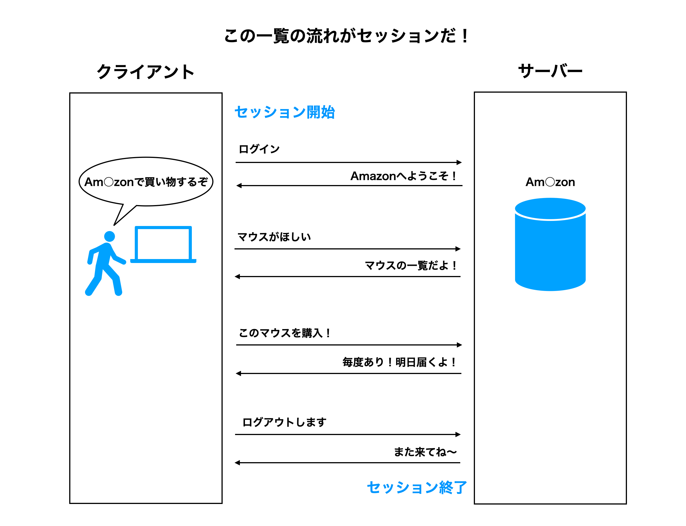
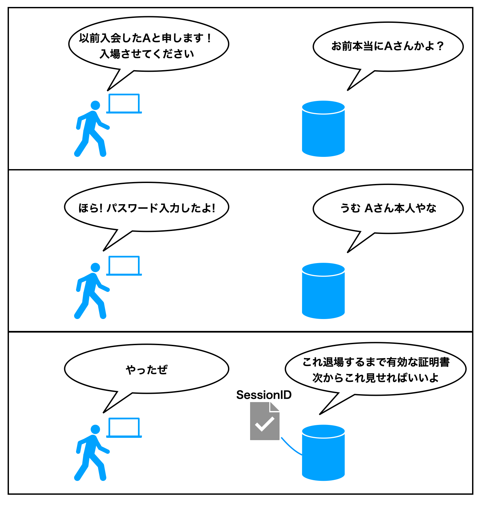

# セッションの概念と認証方式

## 目的

セッションの概念及び、現在で主流なセッション管理方法の知識を共有する。

## 対象読者

下記をなんとなく理解しており、セッションの知識をつけたい方。

- HTTP通信の仕組み
- Webサーバー、クライアントの概念
- Webアプリケーションが動作する仕組み

## 用語の定義

### セッション

一つの通信の開始から終了までのこと。  
クライアントからサーバーへ接続した時点でセッションが始まり、サーバーから切断するとセッションが終了します。

### セッション管理

セッションの一連の流れを管理すること。

### BASE64

バイナリデータを文字列に変換でき、エンコード、デコードができる規格のこと。

### JSON Web Token（JWT）

JSON Web Token（ジェイソン・ウェブ・トークン）は、JSONデータに署名や暗号化を施す方法を定めたオープン標準 (RFC 7519) である。略称はJWT。(ジョットと読みます)
（Wikipediaより引用）

## 背景

Webサーバーはリクエストされた内容を返却するシンプルなものなので  
ユーザーごとに情報を管理したい場合、毎回認証をする必要がありました...

そこでセッションという考え方が生まれました。

## セッションとは

開始から終了までを、一つの通信とする考え方のこと。

## セッションを管理する仕組み

- ログインが成功したときに、サーバーがSessionIDを発行する。
- ユーザーがSessionIDを受け取って保持する。（Cookieに保存することが多い）
- 次回からのリクエストはすべてSessionIDを含めれば、同一ユーザーと判断できるようになる。

## セッション管理の推移

### 最初のころ

SessionIDで「ログインしている」状態のみを保持していました。  
ただこれだと、ログアウトするまで永久に保存されるしSessionIDが流出したら危ない。

### SessionIDの問題

従来のSessionIDだとシンプルな情報しか保持できなかったので、実現できる仕様に限界があり、  
ユーザーはもちろん開発者にとっても不便だった。
そこでログイン状態の判断以外にも、以下のような情報(仕様)が保持できれば自由度が上がると考えられた。

- ユーザーID
- 有効期限
- 機密性を保持する仕組み

### JSON WebToken（JWT）の登場

JSON Web Token（ジェイソン・ウェブ・トークン）は、JSONデータに署名や暗号化を施す方法を定めたオープン標準 (RFC 7519) である。略称はJWT。(ジョットと読みます)
（Wikipediaより引用）

JWTの登場により、JSON形式であれば自由に情報をもたせることができ、  
秘密鍵方式を用いているため、復号化するのに秘密鍵がわからないと解読できないようになっている。

発行日時も暗号化情報に含まれているので、万が一秘密鍵が流出して改ざんできたとしても「改ざんされた」という事実は最低でも検知することができる。

### HTTPでのJWTの使用

暗号化後はBASE64形式の文字列となり、文字列が使用できるインターフェースさえあればよいのでJWTを使用できる範囲はとても広くなる。

HTTPプロトコルの「Header」は、盗まれづらいが文字列しか設定することができない仕様が存在する。  
認証でよく使われる、AuthorizationヘッダーにJWTを設定することで安全にCookieからJWTをサーバーに送信することができる。

## デファクトスタンダードなセッション管理仕様（2021年7月 現在）

### JWTに持たせる情報

- ユーザーID
- 発行日時
- 有効期限

### 共通仕様

- ログインは、Email、Passwordで行うこと。
- ログインが成功したときに、サーバーは秘密鍵をもとにJWTを発行する。
- JWTをクライアントに返却する。
- クライアントはJWTをCookieに保存する。
- リクエスト時はHTTPのAuthorizationヘッダーにJWTを埋め込んでリクエストする（CSRF対策）
- 秘密鍵をもとにサーバーはJWTを解読する。
- JWTが解読できない場合、再ログインを促す（おそらく改ざんされている）

### 有効期限切れの場合

- 有効期限が切れていた場合、JWTを再発行し返却する。
- クライアントは再発行されたJWTを保持し、再ログインすることなくサービスを提供できる。

### 注意点

- 筆者の現場経験の主観が入ってます。
- セキュリティにこだわる場合、ログイン時にワンタイムパスワードやデバイス認証をすることをおすすめします。

## 最後に

セッションの概念と管理する方法、現在の認証方式までざっくりと理解できたかと思います。
JWTの次に新しい認証方式が誕生するかもしれませんが、セッションの基本的な考え方は変わらないと筆者は考えています。

セッションに限らず、どんな技術でも概念をしっかり抑えていれば、新しい技術が登場したときにも理解がしやすくなります。  
より上達すると「どの技術を使うべきか？」 について 自分の考えを持てるようになります。

このフェーズになると技術選定ができるようになり、エンジニアとしての市場価値がかなり上がって年収も増えますよ！
